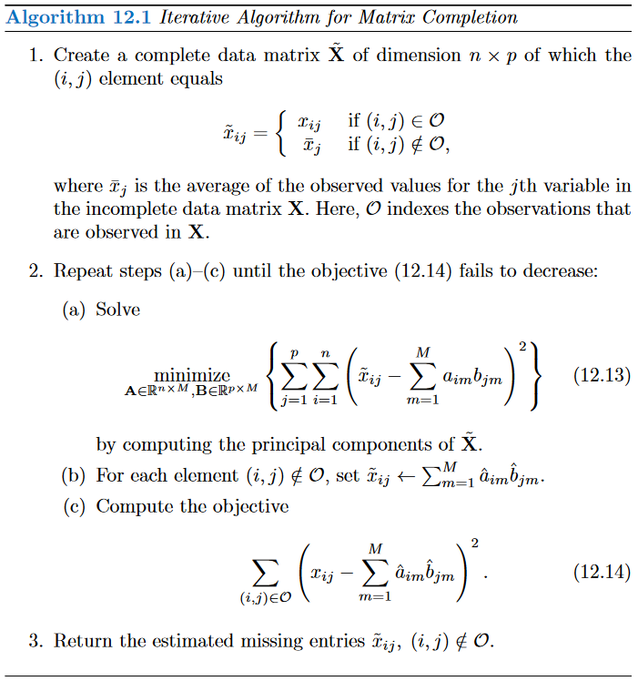
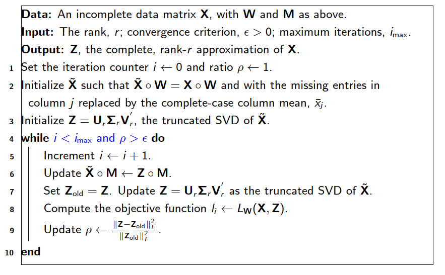
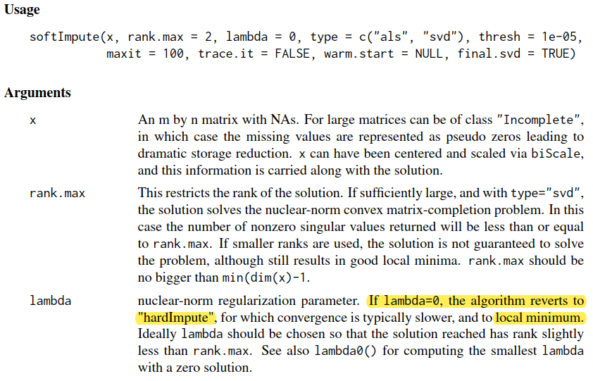

In this tutorial, we will code the matrix completion algorithm and compare out implementation to the `softimpute` package.


```{r, warning=FALSE, message=FALSE}
# Packages required for subsequent analysis. P_load ensures these will be installed and loaded. 
if (!require("pacman")) install.packages("pacman")
pacman::p_load(png,
               knitr,
               tidyverse,
               ggrepel,
               softImpute)
```

# Data Preparation / Problem Setup

Before starting on the algorithm, let us setup the problem by randomly removing entries from a data matrix. For exemplary purposes we will use the `USArrests` dataset which is easily available in R. We want to remove 10% of the entries in the corresponding design matrix. This procedure directly replicates the steps taking in ISLR, p.512. Note that we remove for a subset of states only a single, randomly drawn entry.

```{r}
# set the seed for replicability
set.seed(2022)

# load USArrests data
X_orig <- USArrests

# standardise data
X_orig <- scale(X_orig)

# randomly select 20 out of 50 states
selected_states <- sample(1:dim(X_orig)[1], 20)

# for each selected state select variable to be missing
selected_vars <- sample(1:dim(X_orig)[2], length(selected_states), replace = TRUE)

# remove the randomly selected entries
X <- X_orig

# use lapply, and <<- assign to ensure assignment remains outside of function
set_missing_NA <- lapply(seq_along(selected_states), function(i){
  X[selected_states[i], selected_vars[i]] <<- NA
})

# save missing indices for later graphing
missing_idx <- which(is.na(X), arr.ind = TRUE)

# confirm we removed 10% of the entries
sum(is.na(X)) / (dim(X)[1] * dim(X)[2])
```


# Matrix Completion Algorithm (Hard-Impute)

The matrix completion algorithm can be stated in both summation and matrix notation, both of which you find below.

## ISLR Book (p.512)

```{r, echo=FALSE, fig.pos="H", fig.align="center",out.width="70%"}


# Source: ISLR, p.512
```

```{r, echo=FALSE, fig.pos="H", fig.align="center",out.width="70%"}
X_tilde <- X
for(i in 1:ncol(X_tilde)){
  X_tilde[is.na(X_tilde[,i]), i] <- mean(X_tilde[,i], na.rm = TRUE)
}

old_loss <- X %>% replace_na(0) %>% sum
new_loss <- X %>% replace_na(0) %>% sum %>% `-`(0.0000001)
while (new_loss - old_loss < 0){
  old_loss <- new_loss
  X_tilde <- X_tilde %>% scale
  mypca <- prcomp(X_tilde, scale=F)
  
  prediction <- X_tilde %*% mypca$rotation[,1:3] %*% t(mypca$rotation[,1:3])
    
  for(j in 1:ncol(X_tilde)){
    for(i in 1:nrow(X_tilde)){
      if(is.na(X[i,j])){
        X_tilde[i,j] <- prediction[i,j]
      }
    }
  }
  
  new_loss <- (X - prediction) %>% replace_na(0) %>% sum

  print(new_loss)
}


```

Note that

- $a_{im}$ is the $m$th principal component score of the $i$th state, e.g. $z_{i2} = \phi_{12} x_{i1} + \phi{22} x_{i2} + \cdot + \phi{p2} x_{ip}$ for the second principal component,
- $b_{jm}$ is the factor loading of $j$th feature in the $m$th principal component, e.g. $\phi_{12}$ from above,
- $M$ is the number of the first $M$ principal components.

## Slides

```{r, echo=FALSE, fig.pos="H", fig.align="center", out.width="70%"}


# Source: Lecture SLides
```


# Own Implementation

When you are implementing this yourself, it is worth dividing the task up in several parts:

\begin{itemize}
  \item Create an $X$ where the missing values are replaced with the respective column mean
  \item Create a while loop in which for each iteration:
      \item Calculate the rank $r$ approximation of $X$ with PCA (or SVD)
      \item Update the imputations in $X$
      \item Update the objective function
\end{itemize}


```{r}
# matrix completion function

# Output: matrix X with missing values imputed
```

# Plot Result

Use $M = 2$ and ensure that your matrix completion implementation outputs a full $X$ matrix without any missings. You can then run the code below to compare the true value of the missing entries to the imputed ones. We only use the first two principal components in this case.

```{r, fig.align="center", out.width="70%"}
# get results
imputed_X <- matrix_completion(X, M = 2, eps = 1e-5, max.iter = 1000)

# construct graph
x2 <- imputed_X[missing_idx]
x1 <- X_orig[missing_idx]
missing_var <- missing_idx[,2]
plotdf <- data.frame(y = x2, x = x1, Variable = colnames(X_orig)[missing_var], state = rownames(missing_idx))
plotdf$Variable <- as.factor(plotdf$Variable)

ggplot(data = plotdf, aes(x = x, y = y, color = Variable, label = state)) + 
  geom_point() + theme_bw() + 
  geom_text_repel() + coord_equal() +
  xlim(min(floor(c(x1,x2))), max(ceiling(c(x1,x2)))) + 
  ylim(min(floor(c(x1,x2))), max(ceiling(c(x1,x2)))) + 
  xlab("Original Value") + ylab("Imputed Value") +
  geom_abline(slope = 1, intercept = 0, color = 'red', size = 0.6)
```


# Comparison with Package

```{r}
fits <- softImpute(X, trace = FALSE, type = "svd", rank.max = 2)

# use fits (SVD object) to complete the data matrix
X_package <- complete(X, fits, unscale = FALSE)
```


## Graphical Comparison

```{r, fig.align="center", out.width="70%"}
# update plotdf with package data
plotdf$y_package <- X_package[missing_idx]

ggplot(data = plotdf, aes(x = x, y = y_package, color = Variable, label = state)) + 
  geom_point() + theme_bw() + 
  geom_text_repel() + coord_equal() +
  xlim(min(floor(c(x1,x2))), max(ceiling(c(x1,x2)))) + 
  ylim(min(floor(c(x1,x2))), max(ceiling(c(x1,x2)))) + 
  xlab("Original Value") + ylab("Imputed Value") +
  geom_abline(slope = 1, intercept = 0, color = 'red', size = 0.6)
```

You can, of course, also plot both solutions in the same graph and differentiate between them using shapes or colors.

```{r, fig.align="center", out.width="70%"}
ggplot() + 
  geom_point(data = plotdf, aes(x = x, y = y_package, color = "Package")) + 
  geom_point(data = plotdf, aes(x = x, y = y, color = "Own")) +
  theme_bw() + coord_equal() +
  labs(color = "Implementation") +
  xlim(min(floor(c(x1,x2))), max(ceiling(c(x1,x2)))) + 
  ylim(min(floor(c(x1,x2))), max(ceiling(c(x1,x2)))) + 
  xlab("Original Value") + ylab("Imputed Value") +
  geom_abline(slope = 1, intercept = 0, color = 'red', size = 0.6)
```


## Numerical Comparison

```{r}
# check distance between imputed values
own_imputed <- imputed_X[missing_idx]
pack_imputed <- X_package[missing_idx]

sum((own_imputed - pack_imputed)^2)
```

### Important for the Assignments (and real life):

- **Why** do we see differences? 
- **How** are these differences caused?
- Are these differences important to our problem?


### Potential causes

- the package initializes the missing values as zero and not at the column means (does not make a difference here)
- local vs. global optimum
- does the package use a different underlying function? (SVD vs. prcomp, etc.)
- does the package use an RNG? If so, try to use the same random numbers / subsamples for both implementations.
- generally, check package code or documentation!

```{r, echo=FALSE, fig.pos="H", fig.align="center",out.width="70%"}


```

